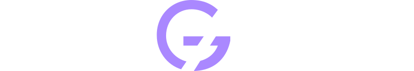

  

---

<!-- Ferramentas e Tecnologias -->

# Estudos de Design 🎨

Este repositório reúne meus **estudos, exercícios, protótipos e anotações** realizados durante o curso de **UI Design para iniciantes** da [Origamid](https://www.origamid.com/).  
O objetivo é documentar minha evolução no design de interfaces e experiência do usuário, explorando principalmente a ferramenta **Figma** e fundamentos de **design visual**, **tipografia**, **cores**, **grid** e **hierarquia visual**.

> Cada pasta contém exercícios práticos, estudos de caso e projetos desenvolvidos ao longo das aulas.

## 📁 Estrutura do Repositório

- [`exercicios/`](exercicios) — Exercícios práticos e desafios propostos no curso.
- [`projetos/`](projetos) — Protótipos e interfaces completas.
- [`anotacoes/`](anotacoes) — Resumos e conceitos importantes de Design.  
- [`assets/`](assets) — Imagens, ícones e materiais visuais utilizados.  
- [`certificados/`](certificados) — Certificados obtidos durante a formação.  

## 🚀 Como Visualizar os Projetos

1. Abra os arquivos no **Figma** (ou na ferramenta utilizada).  
2. Verifique a pasta `assets/` para recursos adicionais.  
3. Alguns projetos podem ter versão web interativa.

## ✍️ Atualizações

O repositório será atualizado conforme avanço no curso, adicionando novos exercícios e projetos.

## ⚖️ Licença

Este projeto está licenciado sob a [MIT License](LICENSE).

## 👤 Autor

**Keven Willians Scharttz de Melo**

  
  
  
